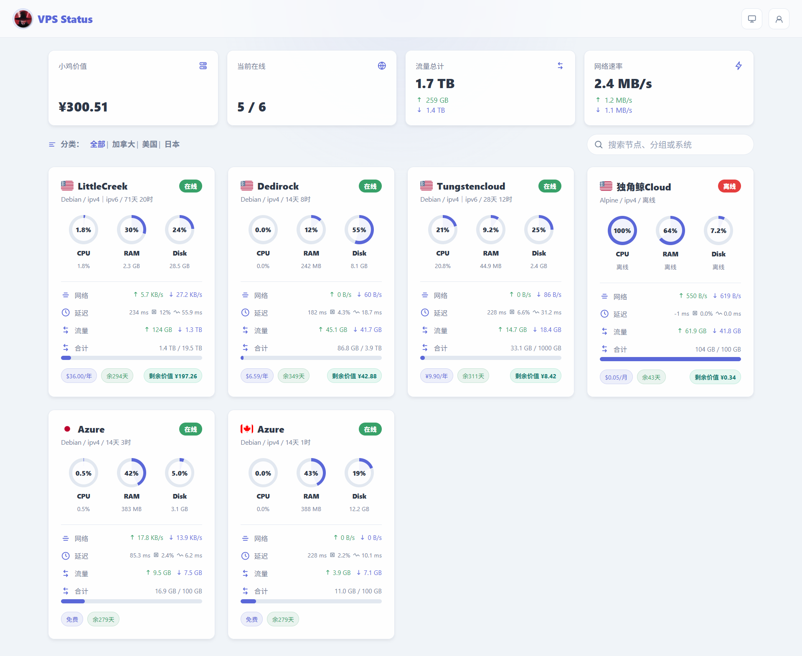
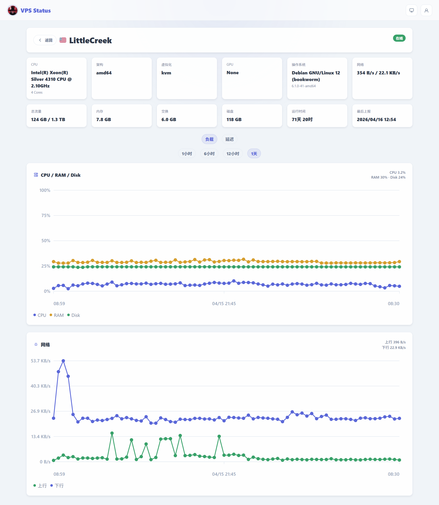

# Komari Horizon

一个为 Komari Monitor 设计的现代、简洁、偏仪表盘风格主题，重点优化首页节点总览与单机详情页的视觉一致性、信息密度和移动端体验。

## Demo

- 在线演示：https://vps.775544.xyz/

## 预览

### 首页总览



### 详情页面



## 项目风格

Horizon 的设计方向不是传统“列表堆字段”，而是更偏现代状态面板：

- 首页使用轻量化顶栏和四个统计卡片，第一屏优先展示节点状态、流量总量、网络速率和整体价值信息。
- 服务器卡片采用紧凑式仪表盘布局，把资源圆环、网络、延迟、流量、计费和剩余价值压缩在一张卡片里，适合快速浏览多台 VPS。
- 详情页延续首页视觉语言，使用大卡片图表展示 CPU / RAM / Disk、网络和延迟变化，减少页面跳脱感。
- 支持浅色、深色和跟随系统主题，整体以简洁留白、细描边、轻阴影为主，不走厚重的传统监控面板路线。

## 功能说明

### 首页

- 顶部统计区域支持显示：
  - 小鸡价值总额
  - 当前在线节点数
  - 流量总计
  - 网络速率
- 分类支持横向切换，移动端分类过多时可左右滑动。
- 搜索支持按节点名称、分组和系统关键词过滤。
- 每个服务器卡片支持显示：
  - 国旗、名称、在线状态
  - 系统 / IPv4 / IPv6 / 在线时间
  - CPU、RAM、Disk 占用圆环
  - CPU 总核数、RAM 总容量、Disk 总容量
  - 网络速率、延迟、流量与总计
  - 价格、剩余天数、剩余价值

### 详情页

- 基础信息卡片展示 CPU、架构、虚拟化、GPU、系统、网络、总流量、内存、交换、磁盘、运行时间和最后上报时间。
- 负载页支持 CPU / RAM / Disk 合并图表。
- 网络图表支持上行、下行走势展示。
- 延迟页支持多地区任务图表，并可按图例开关地区显示。
- 图表和图标支持悬浮提示，便于查看具体时间点数值。

### 主题设置

当前主题设置支持：

- `accent_color`：强调色
- `default_appearance`：默认主题模式
- `show_top_stats`：是否显示首页顶部统计卡片
- `show_filter_bar`：是否显示分类和搜索
- `show_region_flag`：是否显示国旗

## 兼容性说明

就主题自身而言，当前版本已经处理掉之前最容易引发兼容问题的几个点：

- 不再和默认主题共用 `appearance`、`nodeSelectedGroup` 等本地存储键，切换回默认主题时不会因为读到不兼容值而卡死。
- 当目标站点的延迟接口没有数据或返回异常时，首页会降级显示 `-1 ms`，不会一直卡在“载入中”。
- 国旗节点改为尽量复用 DOM，不会因为实时刷新频繁闪动。
- 实时连接增加静默超时自愈，首页和详情页在浏览器切回前台后也会主动补拉一次最新数据。
- 延迟概览和详情页历史图表加入缓存时效控制，不会长时间停留在旧数据。

但主题仍然依赖 Komari 的公开接口和部分外部资源，部署环境不同会有功能降级差异：

- 需要目标站点至少可访问 `/api/public`、`/api/nodes`、`/api/recent/:uuid`、`/api/records/load`、`/api/records/ping`。
- `/api/rpc2` 不可用时，IP 协议族显示会自动退回公共数据判断。
- 如果外部资源域名被屏蔽：
  - 国旗可能无法加载，但不会影响页面渲染。
  - 汇率接口不可用时，剩余价值仍会显示原币种或退回基础说明，不会导致页面卡死。

换句话说，当前版本已经把“主题自身导致的兼容问题”基本收干净，剩余差异主要取决于目标 Komari 实例是否开放对应接口、以及服务器网络环境是否允许访问外部资源。

## 目录结构

```text
.
├── dist/
│   ├── index.html
│   ├── styles.css
│   └── app.js
├── docs/
│   ├── preview-home.png
│   └── preview-detail.png
├── komari-theme.json
├── preview.svg
└── README.md
```

## 使用方法

1. 将 `dist/`、`komari-theme.json`、`preview.svg` 一起打包为 zip。
2. 在 Komari 后台上传该 zip 并启用主题。
3. 如需调整配色或显示项，可在主题设置中修改对应配置。
4. Windows 下不要直接用 `Compress-Archive` 打包主题目录，否则 zip 内部路径可能写成反斜杠，导致 Linux 上的 Komari 找不到 `dist/index.html` 并回退到默认主题。当前仓库提供了 `scripts/package-theme.ps1` 用于生成兼容的发布包。
5. 当前本地打包文件名为 `Komari-Horizon.zip`。

## 更新日志

### v2.8.6

- 将首页与详情页延迟区域中的丢包图标替换为更直观的线条百分比样式，避免看起来像图标资源加载失败
- 更新发布包

### v2.8.5

- 修复 Windows 打包时 zip 内部路径分隔符错误，导致 Linux 上启用主题后静默回退到默认主题的问题
- 新增 `scripts/package-theme.ps1`，统一生成兼容 Komari Linux 部署环境的发布包

### v2.8.4

- 修复部分用户反馈的“页面打开后数据不再自动刷新”问题
- 为实时 websocket 增加静默超时检测，连接卡住时自动切回轮询刷新
- 首页延迟概览加入缓存时效控制，避免延迟数据只加载一次后长期不更新
- 详情页负载图表与延迟图表改为可周期性重新拉取，避免进入详情页后历史数据停留在旧状态
- 页面从后台切回前台时会主动补拉一次首页和详情页数据，减少长时间挂后台后的陈旧显示

### v2.8.3

- 修复首页延迟在无数据环境下长期显示“载入中”的问题，统一降级为 `-1 ms`
- 修复与默认主题共享本地存储导致切回默认主题可能卡死的问题
- 修复国旗在实时刷新时频繁闪动的问题
- 首页卡片中 CPU / RAM / Disk 圆环下方文案改为总资源显示
- 修复移动端分类切换时背景高亮异常变动的问题

### v2.8.2

- 增加顶部“小鸡价值”统计
- 恢复并优化单卡“剩余价值”显示
- 增加默认主题模式设置
- 重构 README、仓库发布和打包流程

### v2.8.1

- 修复主题配置读取与打包结构问题
- 完善主题设置项与发布包结构

### v2.8.0

- 完成 Horizon 主题整体布局重构
- 首页、详情页、主题切换、图表和节点卡片样式统一
